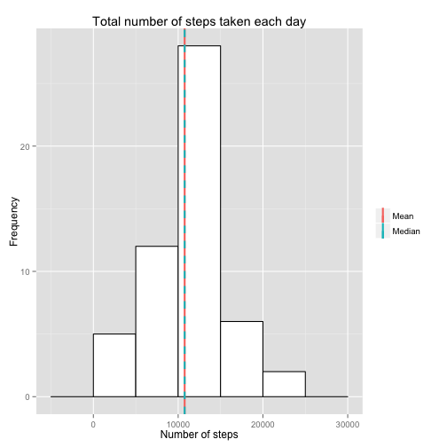
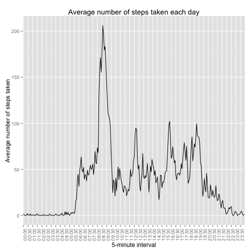
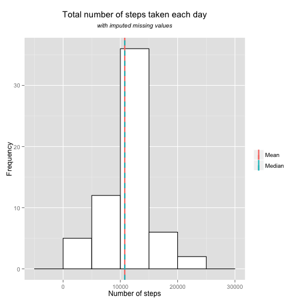
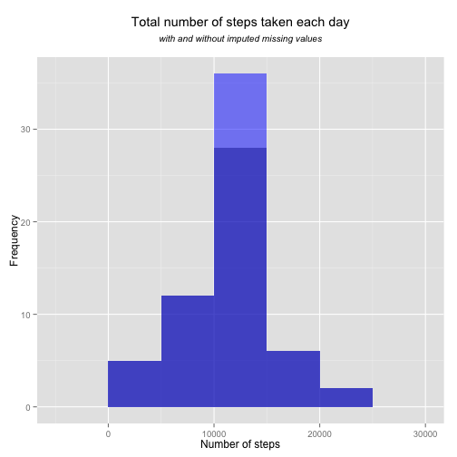
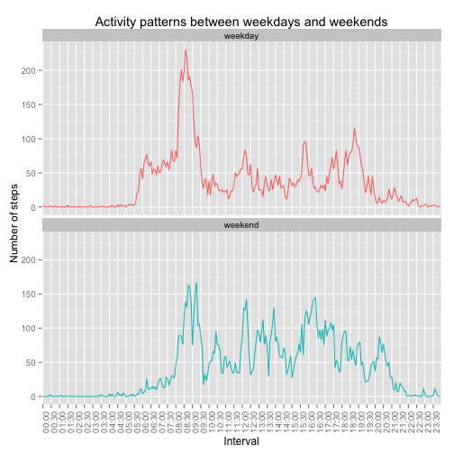

# Reproducible Research: Peer Assessment 1


## Loading and preprocessing the data

```r
data <- read.csv("activity.csv")
#format intervals
data$interval <- sprintf("%04d", data$interval)
data$interval <- paste(substr(data$interval, 0,2), 
                       substr(data$interval, 3,4), 
                       sep=":")
data$interval <- factor(data$interval)
```


## What is mean total number of steps taken per day?
For this part of the assignment, we ignore the missing values in the dataset.

```r
dataWithoutNa <- data[complete.cases(data), ]
```


Make a histogram of the total number of steps taken each day

```r
totPerDay <- aggregate(list(steps=dataWithoutNa$steps), list(date = dataWithoutNa$date), sum)

ggplot(totPerDay, aes(x=steps)) +  
        geom_histogram(colour="black", fill="white", binwidth=5000) +  
        geom_vline(aes(xintercept=mean(steps), color="Mean"), size=1, show_guide=T) +  
        geom_vline(aes(xintercept=median(steps), color="Median"), linetype="dashed", size=1, show_guide=T) +  
        guides(colour=guide_legend(title=NULL)) +
        labs(title = "Total number of steps taken each day", x="Number of steps", y="Frequency")
```

 


Calculate and report the mean and median total number of steps taken per day

```r
c(Mean = mean(totPerDay$steps), Median = median(totPerDay$steps))
```

```
##   Mean Median 
##  10766  10765
```


## What is the average daily activity pattern?
Make a time series plot (i.e. type = "l") of the 5-minute interval (x-axis) and the average number of steps taken, averaged across all days (y-axis)

```r
meanPerInterval <- aggregate(list(steps=dataWithoutNa$steps), list(interval = dataWithoutNa$interval), mean)

ggplot(meanPerInterval) +  
        geom_line(aes(y = steps, x = interval, group = 1)) +
        scale_x_discrete(breaks = meanPerInterval$interval[seq(1,288, by = 6)]) +
        theme(axis.text.x = element_text(angle = 90, hjust = 1)) +
        labs(title = "Average number of steps taken each day",
             x="5-minute interval",
             y="Average number of steps taken")
```

 


Which 5-minute interval, on average across all the days in the dataset, contains the maximum number of steps?

```r
meanPerInterval[meanPerInterval$steps == max(meanPerInterval$steps), ]
```

```
##     interval steps
## 104    08:35 206.2
```


## Imputing missing values
Calculate and report the total number of missing values in the dataset (i.e. the total number of rows with NAs)

```r
colSums(is.na(data))
```

```
##    steps     date interval 
##     2304        0        0
```

 
Devise a strategy for filling in all of the missing values in the dataset. The strategy does not need to be sophisticated. For example, you could use the mean/median for that day, or the mean for that 5-minute interval, etc.

=> We will fill missing values with the mean (across all days) for that 5-minutes interval.  
We choose this strategy because we have observed patterns accross intervals (similar numbers of steps, every day, at the same hour/minute) rather than days (except for weekdays and weekends).  
Filling the missing values with mean/median for that day is impossible because, when a value is missing, all the 288 values for that day are missing, as shown in the following summary:

```r
summary(data[is.na(data$steps), "date"])
```

```
## 2012-10-01 2012-10-02 2012-10-03 2012-10-04 2012-10-05 2012-10-06 
##        288          0          0          0          0          0 
## 2012-10-07 2012-10-08 2012-10-09 2012-10-10 2012-10-11 2012-10-12 
##          0        288          0          0          0          0 
## 2012-10-13 2012-10-14 2012-10-15 2012-10-16 2012-10-17 2012-10-18 
##          0          0          0          0          0          0 
## 2012-10-19 2012-10-20 2012-10-21 2012-10-22 2012-10-23 2012-10-24 
##          0          0          0          0          0          0 
## 2012-10-25 2012-10-26 2012-10-27 2012-10-28 2012-10-29 2012-10-30 
##          0          0          0          0          0          0 
## 2012-10-31 2012-11-01 2012-11-02 2012-11-03 2012-11-04 2012-11-05 
##          0        288          0          0        288          0 
## 2012-11-06 2012-11-07 2012-11-08 2012-11-09 2012-11-10 2012-11-11 
##          0          0          0        288        288          0 
## 2012-11-12 2012-11-13 2012-11-14 2012-11-15 2012-11-16 2012-11-17 
##          0          0        288          0          0          0 
## 2012-11-18 2012-11-19 2012-11-20 2012-11-21 2012-11-22 2012-11-23 
##          0          0          0          0          0          0 
## 2012-11-24 2012-11-25 2012-11-26 2012-11-27 2012-11-28 2012-11-29 
##          0          0          0          0          0          0 
## 2012-11-30 
##        288
```


Create a new dataset that is equal to the original dataset but with the missing data filled in.

```r
dataWithImpute <- data
naSteps <- is.na(dataWithImpute$steps)
dataWithImpute[naSteps, "steps"] <- meanPerInterval[dataWithImpute[naSteps, "interval"], "steps"]
```


Make a histogram of the total number of steps taken each day and Calculate and report the mean and median total number of steps taken per day. Do these values differ from the estimates from the first part of the assignment?

```r
totPerDayWithImpute <- aggregate(list(steps=dataWithImpute$steps), list(date = dataWithImpute$date), sum)

ggplot(totPerDayWithImpute, aes(x=steps)) +  
        geom_histogram(colour="black", fill="white", binwidth=5000) +  
        geom_vline(aes(xintercept=mean(steps), color="Mean"), size=1, show_guide=TRUE) +  
        geom_vline(aes(xintercept=median(steps), color="Median"), linetype="dashed", size=1, show_guide=TRUE) +  
        guides(colour=guide_legend(title=NULL)) +
        labs(x="Number of steps", y="Frequency") +
        ggtitle(expression(atop("Total number of steps taken each day", 
                                atop(italic("with imputed missing values"), ""))))
```

 

```r

c(Mean=mean(totPerDayWithImpute$steps), Median=median(totPerDayWithImpute$steps))
```

```
##   Mean Median 
##  10766  10766
```


=> Imputing missing data does not have a major effect on Mean and Median: Mean did not changed and Median is a little higher (+1)

What is the impact of imputing missing data on the estimates of the total daily number of steps?

```r
ggplot(totPerDayWithImpute,aes(x=steps)) + 
        geom_histogram(data=totPerDay, alpha = 0.5, binwidth=5000, show_guide=TRUE) +
        geom_histogram(data=totPerDayWithImpute,fill = "blue", alpha = 0.5, binwidth=5000, show_guide=TRUE) +
        labs(x="Number of steps", y="Frequency") +
        ggtitle(expression(atop("Total number of steps taken each day", 
                                atop(italic("with and without imputed missing values"), ""))))
```

 

=> Imputing missing data increased the number of observations (8 days of 288 intervals) but, as we do not have "extreme" values in the dataset, the imputed values didn't modified significantly the mean and median.

## Are there differences in activity patterns between weekdays and weekends?
For this part the weekdays() function may be of some help here. Use the dataset with the filled-in missing values for this part.

Create a new factor variable in the dataset with two levels – “weekday” and “weekend” indicating whether a given date is a weekday or weekend day.

```r
isWE <- weekdays(as.Date(dataWithImpute$date)) %in% c("Sunday", "Saturday")

dataWithImpute <- cbind(dataWithImpute, type.day=sapply(isWE, function(elt) if (elt) "weekend" else "weekday"))

meanPerInterval <- aggregate(list(steps=dataWithImpute$steps),
                             list(interval = dataWithImpute$interval, 
                                  type.day = dataWithImpute$type.day), mean)
```


Make a panel plot containing a time series plot (i.e. type = "l") of the 5-minute interval (x-axis) and the average number of steps taken, averaged across all weekday days or weekend days (y-axis). The plot should look something like the following, which was creating using simulated data:

```r
ggplot(meanPerInterval) +  
        geom_line(aes(y = steps, x = interval, group = type.day, col=type.day), show_guide=F) +
        scale_x_discrete(breaks = meanPerInterval$interval[seq(1,288, by = 6)]) +
        theme(axis.text.x = element_text(angle = 90, hjust = 1)) + 
        facet_wrap( ~ type.day, ncol=1) + 
        scale_fill_brewer(palette="Set3") + 
        labs(title = "Activity patterns between weekdays and weekends", x="Interval", y="Number of steps")
```

 

